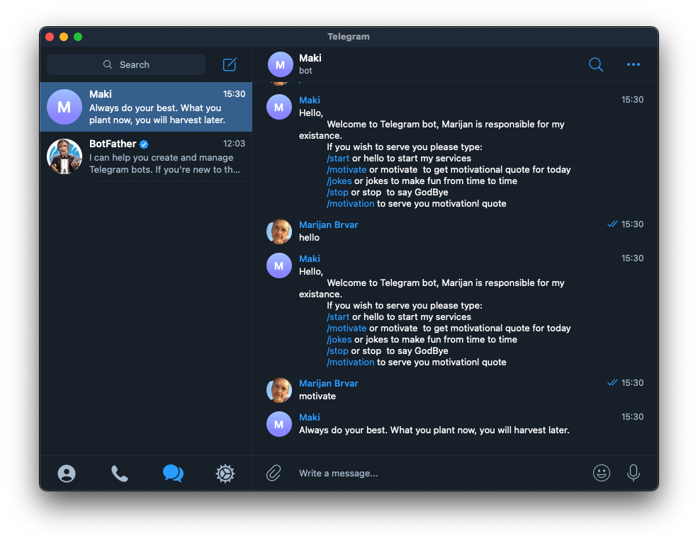

# Telegram bot | written with Ruby

> I build this project to demonstrate how to use the Ruby programming language to create a Telegram bot. Bot are small practical applications capable of providing shortcuts to your desire's content with practically no effort. Bot do take care of repetitive processes.

> Bots are third-party applications that run inside Telegram. Users can interact with bots by sending them messages, commands and inline requests. You control your bots using HTTPS requests to our Bot API.

## Built With

- Ruby
- Telegram bot API

## Test With
- Rspec

## Getting Started

**This is an example of how you may give instructions on setting up your project locally.**
**Modify this file to match your project, remove sections that don't apply. For example: delete the testing section if the currect project doesn't require testing.**

To get a local copy up and running follow these simple example steps.

### Prerequisites
1. Account @Telegram
2. Ruby
3. Rspec

### Setup
If you wish to use my boot, please click on this (link)['t.me/makiruby_bot']. And we will start talking :-)

### Install

### Usage

### Run tests

### Deployment

## Authors

## 🤝 Contributing

Contributions, issues, and feature requests are welcome!

Feel free to check the [issues page](issues/).

## Show your support

Give a ⭐️ if you like this project!

## Acknowledgments

- Hat tip to anyone whose code was used
- Inspiration
- etc

## 📝 License

This project is [MIT](lic.url) licensed.
